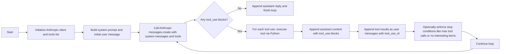

# Architecture Design: News Explorer Agent

## 1. Introduction

The News Explorer is an autonomous agent that uses Claude (via the Anthropic Python SDK) to browse Reddit and Hacker News, read pages and comments, and decide what is worth reading or discussing. The architecture follows Domain-Driven Design (DDD) and Clean Architecture principles, while keeping the agent loop and tool usage strictly aligned with the `v4_skills_agent.py` style and the official Anthropic tool-use patterns.【turn0search0】【turn0search1】【turn0search3】

## 2. Design Principles

- **Dependency rule:** Source code dependencies point inward. Domain knows nothing about Anthropic, Reddit, or Hacker News.
- **Agent control loop:** The application layer manages the conversation loop (similar to v4_skills_agent.py), not a generic `chat()` function.
- **Tool-driven interaction:** We define tools (schemas), pass them to `client.messages.create(...)`, and then handle `tool_use` blocks and `tool_result` messages explicitly.
- **Stateless Messages API:** The Anthropic Messages API is stateless; we always send the full conversation history, exactly as in your v4 example.【turn0search2】【turn0search3】

## 3. High-Level Architecture

The overall layering follows Clean Architecture:

- Interfaces: CLI (and potentially future web endpoints).
- Application: Orchestrates the agent loop, applies business rules.
- Domain: Core entities and repository interfaces (ports).
- Infrastructure: Implements ports (Anthropic SDK, scrapers, web reader).

```text
+-------------------+
| Interfaces (CLI)  |
+---------+---------+
          |
+---------v---------+
| Application       |
| - Agent Loop      |
| - Use Cases       |
+---------+---------+
          |
+---------v---------+
| Domain            |
| - Entities        |
| - Repo Interfaces |
+---------+---------+
          ^         ^
          |         |
+---------+---------+
| Infrastructure    |
| - Anthropic SDK   |
| - Scrapers        |
+-------------------+
```

## 4. Agent Loop Design (v4_skills_agent.py Style)



The agent loop is the core of the application. It is not hidden inside a library; it is explicitly coded in the Application layer, following the same pattern as @references/v4_skills_agent.py:

- Call `client.messages.create(model, system, messages, tools, max_tokens)`.
- Iterate over `response.content`:
  - If text: print / store.
  - If `tool_use`: collect into `tool_calls`.
- If `stop_reason != "tool_use"`: append assistant message and exit.
- For each tool call:
  - Execute a corresponding Python function.
  - Build a `tool_result` block with `tool_use_id` and the result text.
- Append the assistant message and the tool results (as a user message) to `messages`.
- Repeat.

### 4.1 Pseudocode of the Loop

```python
def agent_loop(messages: list) -> list:
    while True:
        response = client.messages.create(
            model=MODEL,
            system=SYSTEM,
            messages=messages,
            tools=ALL_TOOLS,
            max_tokens=MAX_TOKENS,
        )

        tool_calls = []
        for block in response.content:
            if hasattr(block, "text"):
                print(block.text)
            if block.type == "tool_use":
                tool_calls.append(block)

        if response.stop_reason != "tool_use":
            messages.append({"role": "assistant", "content": response.content})
            return messages

        results = []
        for tc in tool_calls:
            print(f"\n> {tc.name}")

            output = execute_tool(tc.name, tc.input)

            preview = output[:200] + "..." if len(output) > 200 else output
            print(f"  {preview}")

            results.append({
                "type": "tool_result",
                "tool_use_id": tc.id,
                "content": output
            })

        messages.append({"role": "assistant", "content": response.content})
        messages.append({"role": "user", "content": results})
```

This is exactly the style used in v4_skills_agent.py and matches Anthropic’s recommended tool-use flow in their docs.

## 5. Anthropic SDK Usage and Tool Definitions

We focus exclusively on the Anthropic Python SDK and make explicit use of tools (function calling). No generic `chat()` abstraction is required; we control the loop ourselves.

### 5.1 Tool Definitions

Tools are defined as JSON schemas and passed via the `tools` argument when calling `client.messages.create(...)`. Each tool has:

- `name`
- `description`
- `input_schema` (properties and required fields)

Example tool definitions in the Infrastructure layer (for Python):

```python
BASE_TOOLS = [
    {
        "name": "read_file",
        "description": "Read file contents.",
        "input_schema": {
            "type": "object",
            "properties": {
                "path": {"type": "string"},
                "limit": {"type": "integer"}
            },
            "required": ["path"],
        },
    },
    ...
]

EXPLORATION_TOOLS = [
    {
        "name": "get_reddit_posts",
        "description": "Fetch hot posts from a subreddit.",
        "input_schema": {
            "type": "object",
            "properties": {
                "subreddit": {"type": "string"},
                "limit": {"type": "integer"}
            },
            "required": ["subreddit"],
        },
    },
    {
        "name": "get_hn_stories",
        "description": "Fetch Hacker News top/new/best stories.",
        "input_schema": {
            "type": "object",
            "properties": {
                "story_type": {"type": "string", "enum": ["top", "new", "best"]},
                "limit": {"type": "integer"}
            },
            "required": ["story_type"],
        },
    },
    {
        "name": "read_webpage",
        "description": "Read a webpage as clean markdown.",
        "input_schema": {
            "type": "object",
            "properties": {
                "url": {"type": "string"}
            },
            "required": ["url"],
        },
    },
    {
        "name": "get_comments",
        "description": "Fetch comments for a given post or story.",
        "input_schema": {
            "type": "object",
            "properties": {
                "platform": {"type": "string", "enum": ["reddit", "hackernews"]},
                "post_id": {"type": "string"},
                "limit": {"type": "integer"}
            },
            "required": ["platform", "post_id"],
        },
    },
    {
        "name": "finish_exploration",
        "description": "Stop the exploration and provide a summary.",
        "input_schema": {
            "type": "object",
            "properties": {
                "summary": {"type": "string"},
                "interesting_links": {"type": "array", "items": {"type": "string"}}
            },
            "required": ["summary"],
        },
    },
]

ALL_TOOLS = BASE_TOOLS + EXPLORATION_TOOLS
```

These tool schemas are stored in Infrastructure (e.g., `infrastructure/llm/tool_schemas.py`) and loaded into the Application layer for use in the loop.

### 5.2 Handling Tool Results

When the model generates a `tool_use` block, we:

- Extract `tc.name` and `tc.input`.
- Dispatch to the corresponding Python implementation (`execute_tool(tc.name, tc.input)`).
- Return the result as a string.

Crucially, we follow Anthropic’s required message structure:

```python
messages.append({"role": "assistant", "content": response.content})
messages.append({"role": "user", "content": results})
```

Here, `results` is a list of objects with `type: "tool_result"`, `tool_use_id`, and `content`, exactly as recommended in Anthropic’s tool-use docs.【turn0search0】【turn0search1】

## 6. Domain Layer

The Domain layer contains entities and repository interfaces (ports). It knows nothing about Anthropic or the concrete sources.

### 6.1 Entities

- `ExplorationSession`
  - Tracks the current state: whether exploration is finished, tool call counters, interesting links found, etc.
- `Article`
  - Represents an article or story: platform, ID, title, URL, score, number of comments, etc.

### 6.2 Repository Interfaces (Ports)

- `ILLMProvider`
  - Interface for the LLM used by the Application layer.
  - In practice implemented by `AnthropicAdapter` using the Anthropic SDK.
  - Method examples: `chat(messages, tools) -> LLMResponse`.

- `IContentSource`
  - Interface for fetching posts and comments from Reddit and Hacker News.
  - Methods: `get_hot_posts(board, limit)`, `get_comments(post_id, limit)`.

- `IWebBrowser`
  - Interface for reading URLs as clean text/markdown.
  - Method: `read(url: str) -> str`.

## 7. Application Layer

The Application layer contains the agent orchestrator and use cases. This is where the v4-style loop lives.

### 7.1 AgentOrchestrator

- Maintains an `ExplorationSession`.
- Implements the agent loop similar to v4_skills_agent.py.
- Uses `ILLMProvider` (AnthropicAdapter) and the tool schemas.
- Applies business rules:
  - Stop if too many tool calls have been made.
  - Stop if the model invokes `finish_exploration`.
  - Stop if no interesting items have been found after several pages.

Pseudocode sketch:

```python
class AgentOrchestrator:
    def __init__(self, llm: ILLMProvider, sources: dict, browser: IWebBrowser):
        self.llm = llm
        self.sources = sources  # e.g. {"reddit": RedditAdapter, "hn": HNAdapter}
        self.browser = browser
        self.session = ExplorationSession()

    def start(self, user_message: str):
        messages = [self._system_message(), {"role": "user", "content": user_message}]

        while not self.session.is_finished():
            response = self.llm.chat(messages, ALL_TOOLS)

            messages.append({"role": "assistant", "content": response.content})

            tool_calls = [b for b in response.content if b.type == "tool_use"]
            if not tool_calls:
                break

            results = []
            for tc in tool_calls:
                if self._should_stop():
                    break

                output = self._execute_tool(tc.name, tc.input)
                results.append({
                    "type": "tool_result",
                    "tool_use_id": tc.id,
                    "content": output
                })

            messages.append({"role": "user", "content": results})
```

### 7.2 Use Cases

- `StartExplorationUseCase`
  - Prepares initial messages, config, and starts `AgentOrchestrator`.

## 8. Infrastructure Layer

Infrastructure implements the ports using concrete libraries, focusing on the Anthropic SDK and scrapers.

### 8.1 AnthropicAdapter

- Wraps `anthropic.Anthropic`.
- Implements `ILLMProvider`.
- Converts domain messages into the format expected by the SDK.
- Passes tool schemas and returns an `LLMResponse` containing:
  - Text (if any)
  - Tool use blocks (list of `tool_use` objects)
  - `stop_reason`

Example sketch:

```python
import anthropic

class AnthropicAdapter:
    def __init__(self, api_key: str, model: str = "claude-3-5-sonnet-20241022"):
        self.client = anthropic.Anthropic(api_key=api_key)
        self.model = model

    def chat(self, messages: list, tools: list):
        response = self.client.messages.create(
            model=self.model,
            system=messages[0]["content"] if messages[0]["role"] == "system" else None,
            messages=[m for m in messages if m["role"] != "system"],
            tools=tools,
            max_tokens=4096,
        )
        # Simplified: map response.content to domain objects
        return LLMResponse.from_anthropic(response)
```

### 8.2 Content Source Adapters

- `RedditAdapter`: Uses `praw` to implement `IContentSource` for Reddit.
- `HackerNewsAdapter`: Uses HTTP requests to implement `IContentSource` for HN.

### 8.3 Web Reader Adapter

- `JinaReaderAdapter`: Uses a service (e.g., Jina Reader) to implement `IWebBrowser`.
  - Converts a URL into clean Markdown text.
  - This content is then passed to Claude via tool results.

## 9. Interface Layer

- `cli/main.py`
  - Entry point that wires everything together:
    - Creates `AnthropicAdapter`.
    - Creates adapters for Reddit and HN.
    - Creates `AgentOrchestrator`.
    - Runs a REPL similar to v4_skills_agent.py:
      - Reads user input.
      - Starts exploration.
      - Prints the model’s responses and tool actions.

## 10. Tool Usage and Safety Policies

To keep the agent safe and cost-effective:

- Limit the number of tool calls in `ExplorationSession`.
- Provide a `finish_exploration` tool and encourage the model to call it explicitly.
- Avoid sending entire HTML pages; use a reader to get clean text/markdown.
- For any `bash`-like tools, restrict commands (as done in v4_skills_agent.py).

## 11. Directory Structure

A possible structure aligned with this design:

```text
news_explorer/
├── domain/
│   ├── entity/
│   │   ├── exploration_session.py
│   │   └── article.py
│   └── repository/
│       ├── i_llm_provider.py
│       ├── i_content_source.py
│       └── i_web_browser.py
│
├── application/
│   ├── service/
│   │   └── agent_orchestrator.py
│   └── usecase/
│       └── start_exploration.py
│
├── infrastructure/
│   ├── llm/
│   │   ├── anthropic_adapter.py
│   │   └── tool_schemas.py
│   └── scraper/
│       ├── reddit_adapter.py
│       ├── hn_adapter.py
│       └── jina_reader_adapter.py
│
└── interfaces/
    └── cli/
        └── main.py
```

## 12. Summary

- The agent loop and tool usage are directly inspired by v4_skills_agent.py and Anthropic’s official tool-use examples.【turn0search0】【turn0search1】【turn0search3】  
- The architecture follows DDD and Clean Architecture, with a clear separation between:
  - Domain (entities and ports),
  - Application (orchestration and use cases),
  - Infrastructure (Anthropic SDK, Reddit/HN, web reader),
  - Interfaces (CLI).  
- We focus exclusively on the Anthropic Python SDK and do not rely on generic `chat()` helpers. The Application layer explicitly drives `client.messages.create(...)`, processes `tool_use` blocks, and appends tool results in the correct format.  

